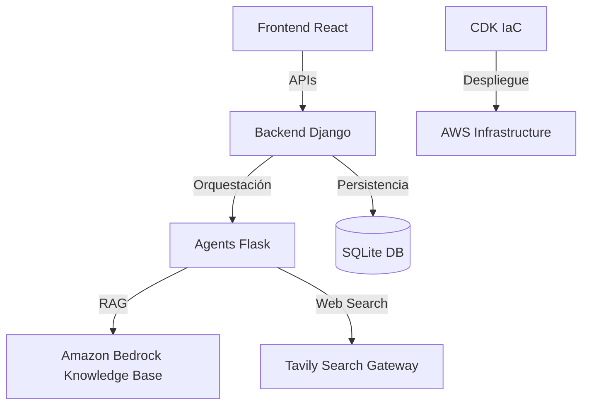
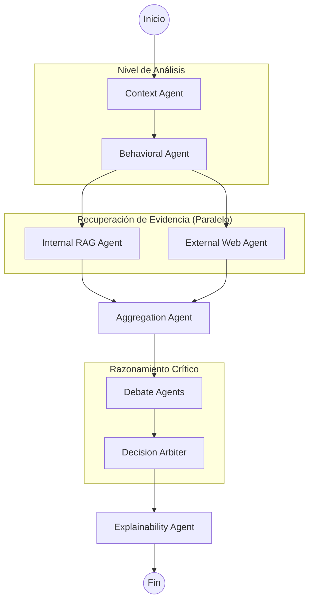

# 🏦 BCP Fraud Detection: Multi-Agent System (MAS)

Sistema inteligente de detección de fraude en tiempo real basado en una arquitectura **Multi-Agente (MAS)**, **RAG** (Retrieval-Augmented Generation), y **Búsqueda Web Gobernada**. El sistema combina el análisis de comportamiento histórico, políticas internas y amenazas externas para tomar decisiones precisas y explicables.

---

## 🏗️ Arquitectura y Estrategia Tecnológica

El sistema se divide en tres capas principales desacopladas para garantizar escalabilidad, seguridad y agilidad en el desarrollo.

### 🧠 ¿Por qué Django + Flask?
- **Django (Backend API)**: Se eligió como el núcleo de la aplicación por su robusto ORM (Object-Relational Mapper), sistema de autenticación integrado y capacidad para gestionar flujos de trabajo complejos como el **Human-in-the-Loop (HITL)**. Su estructura permite un manejo profesional de la base de datos y la lógica de auditoría.
- **Flask (Agents Service)**: Actúa como un microservicio ligero y de baja latencia especializado en la orquestación de IA. Al usar Flask para los agentes, aislamos la ejecución de **LangGraph** y las llamadas a LLMs, evitando que procesos largos de inferencia bloqueen la API transaccional de Django.

---

## 🔬 RAG vs. Comparaciones Lógicas: El "Por Qué"

Una de las decisiones arquitectónicas clave es el uso de **RAG (Retrieval-Augmented Generation)** para procesar las políticas de fraude, en lugar de depender únicamente de motores de reglas (`if/else`) tradicionales.

### Ventajas del enfoque RAG:
1.  **Flexibilidad Lingüística**: Las políticas de cumplimiento y riesgos suelen escribirse en lenguaje natural (ej: *"Bloquear transacciones sospechosas en perfiles de alto riesgo durante la madrugada"*). RAG permite que el sistema entienda estas reglas sin necesidad de traducirlas manualmente a código rígido.
2.  **Mantenimiento Ágil**: Actualizar una política es tan sencillo como subir un nuevo documento `.json` o `.pdf` a S3. No requiere cambios en el código fuente, despliegues de backend, ni migraciones de base de datos.
3.  **Búsqueda Semántica vs. Exacta**: A diferencia de una comparación lógica que falla si un valor no es exacto, RAG utiliza **embeddings** para encontrar políticas relacionadas por concepto. Si una transacción presenta un patrón "atípico pero no idéntico" a una regla, el sistema puede recuperar el contexto relevante.
4.  **Citas y Transparencia**: RAG permite que el agente genere una respuesta con **citaciones directas** al texto original de la política. Esto es fundamental para que el auditor humano entienda *exactamente qué línea del reglamento* motivó la decisión de la IA.

---

### 🧠 Orquestación Multi-Agente
El sistema utiliza **LangGraph** para gestionar un grafo de estado cíclico y paralelo, permitiendo que agentes especializados colaboren en tiempo real.

#### Grafo de Flujo (LangGraph)

### 📝 Directorio de Agentes
A diferencia de un script secuencial, cada agente en este sistema tiene un rol definido dentro del grafo:

| Agente | Función Principal |
| :--- | :--- |
| **Transaction Context** | Realiza el primer filtro de señales "hard" (u-monto, país, horario). |
| **Behavioral Pattern** | Analiza anomalías en dispositivos y patrones históricos de uso. |
| **Internal Policy RAG** | Recupera reglas de cumplimiento desde Amazon Bedrock KB. |
| **External Threat Intel** | Busca alertas de fraude activas en la web (via Tavily). |
| **Evidence Aggregator** | Consolida señales y evidencias en un resumen ejecutivo objetivo. |
| **Debate (Pro-Fraud/Cust)** | Ejecuta un análisis dialéctico para evitar sesgos y falsos positivos. |
| **Decision Arbiter** | Ejecuta la lógica final y el escalamiento a humano (HITL) si la confianza es < 0.6. |
| **Explainability** | Genera reportes diferenciados para el cliente (empático) y auditoría (técnico). |

---

## 🔬 El Corazón del Sistema: RAG Proactivo

Una de las decisiones arquitectónicas clave es el uso de **RAG (Retrieval-Augmented Generation)** mediante **Amazon Bedrock Knowledge Bases**.

### ¿Por qué no usar reglas `if/else`?
1.  **Flexibilidad Semántica**: Las políticas bancarias cambian y se redactan en lenguaje natural. RAG permite que el sistema "entienda" una política como *"Bloquear montos inusuales en la madrugada"* sin necesidad de programar cada variable manualmente.
2.  **Búsqueda Vectorial**: Utilizamos **embeddings** para encontrar políticas relacionadas por concepto. Si una transacción es "sospechosa" pero no viola una regla exacta literal, el sistema puede recuperar el contexto de políticas similares.
3.  **Metadata Recovery Fallback**: Nuestro servicio de RAG (`aws_rag_service.py`) incluye una lógica de recuperación avanzada. Si el Knowledge Base devuelve un fragmento de texto pero pierde los metadatos de ID, el sistema cruza la información con un mapa local (`fraud_policies.json`) para garantizar que la citación en el reporte sea exacta y rastreable.

### ⚡ Patrones de Diseño y Estrategia Técnica

El sistema implementa una arquitectura moderna basada en la separación de responsabilidades y la reactividad:

1.  **Arquitectura de Microservicios**:
    - **Frontend (React/Vite)**: Capa de presentación desacoplada del procesamiento.
    - **Backend API (Django)**: Núcleo de gestión de datos, autenticación y auditoría.
    - **Agent Microservice (Flask)**: Servicio especializado en inferencia de IA, evitando bloqueos por latencia de LLM en la API principal.
2.  **MVT (Model-View-Template)**:
    - Aplicado en el Backend Django para una estructura de datos clara y una lógica de negocio (Views) separada del modelo relacional.
3.  **Patrón State (LangGraph)**:
    - La orquestación de agentes no es lineal; es un grafo de estados que permite ciclos, decisiones dinámicas y ejecución en paralelo (RAG + Web Search).
4.  **Service / Repository Pattern**:
    - La lógica pesada de negocio y la integración con Bedrock están encapsuladas en `services.py`, facilitando la mantenibilidad y las pruebas unitarias.
5.  **Factory Pattern**:
    - Utilizado en la generación de reportes (`report_service.py`) para crear diferentes formatos y tipos de auditoría según la decisión tomada.
6.  **Structured Output & Validation**:
    - Uso de **Pydantic** para forzar contratos de datos estrictos en la comunicación entre agentes y el backend.
7.  **Parallel Execution**:
    - Los agentes de RAG y Búsqueda Web se ejecutan en paralelo para optimizar la latencia general del sistema.
8.  **Specialized LLM Role**:
    - Se utiliza `Claude 4.5 Sonnet` como modelo único de alto razonamiento para garantizar coherencia en el flujo de debate y decisión estratégica.
9.  **Structured Output**:
    - El árbitro final utiliza esquemas de Pydantic para garantizar que la respuesta sea siempre un JSON válido procesable por el backend.

---

## 📊 Persistencia y Audit Trail

### 💾 Almacenamiento de Datos
1.  **Datos Estructurados (SQLite/PostgreSQL)**: Persistencia de transacciones, perfiles y el registro de auditoría (`DecisionRecord`).
2.  **Knowledge Base**: Almacenamiento vectorial de políticas.

### 📜 Audit Trail (Trazabilidad)
Cada decisión genera un rastro de auditoría inmutable:
- **`DecisionRecord`**: Almacena el resultado final, confianza, señales y citaciones.
- **`AuditEvent`**: Log detallado de la "Ruta de Agentes" seguida.
- **Reportes PDF**: Generados mediante un servicio especializado que consolida la evidencia técnica para auditores.

---

## 🚀 CI/CD: Automatización y Despliegue

El proyecto incluye un pipeline de entrega continua (CD) totalmente automatizado utilizando **AWS CodePipeline** y **AWS CodeBuild**, definido como código en el stack de CDK.

### Flujo del Pipeline:
1.  **Source Stage**: Detecta cambios en la rama `master` del repositorio de GitHub mediante un Webhook.
2.  **Build Stage**:
    - **Dockerización**: Construye, etiqueta y sube las imágenes de `backend/` y `agents/` a **Amazon ECR**.
    - **Frontend Build**: Ejecuta `npm run build` para generar los activos estáticos de React.
3.  **Deploy Stage**:
    - **IaC Sync**: Ejecuta `cdk deploy` para actualizar cualquier cambio en la infraestructura (ALB, ECS, S3).
    - **S3 Sync**: Sincroniza los archivos del frontend y limpia el caché de **CloudFront**.
4.  **Post-Deploy (Tareas Automáticas)**:
    - **Seeding**: Ejecuta automáticamente `python manage.py seed_data` en el contenedor de ECS para asegurar que los datos base existan.
    - **RAG Ingestion**: Dispara el comando `ingest_rag` para sincronizar las últimas políticas con el Knowledge Base de Bedrock.

---

## 🔑 Gestión de Secretos y Seguridad

El proyecto implementa prácticas recomendadas de seguridad en AWS:
- **AWS Secrets Manager**: Almacena llaves sensibles como `TAVILY_API_KEY`, `LANGCHAIN_API_KEY` y `DJANGO_SECRET_KEY`. Esto evita que las llaves estén expuestas en el código o en variables de entorno locales.
- **AWS Systems Manager (Parameter Store)**: Gestiona configuraciones de entorno (ej: `BEDROCK_KB_ID`, `DJANGO_DEBUG`) de forma centralizada.
- **Gobierno de Búsqueda**: La búsqueda web a través de **Tavily** está limitada a una `allowlist` de dominios confiables (bcp.com.pe, gestion.pe, etc.), mitigando el riesgo de alucinaciones basadas en fuentes no oficiales.

---

## 🎨 Frontend y UI
- **Arquitectura**: Basada en componentes funcionales de **React** y **Vite**.
- **User Experience**: Dashboard dinámico que muestra métricas de salud del sistema, transacciones en tiempo real y una cola de gestión de casos (HITL) para que analistas humanos tomen decisiones finales en casos ambiguos.

---

## 🚀 Guías Complementarias
- [Guía de Despliegue y Configuración Local](README_DEPLOY.md)
