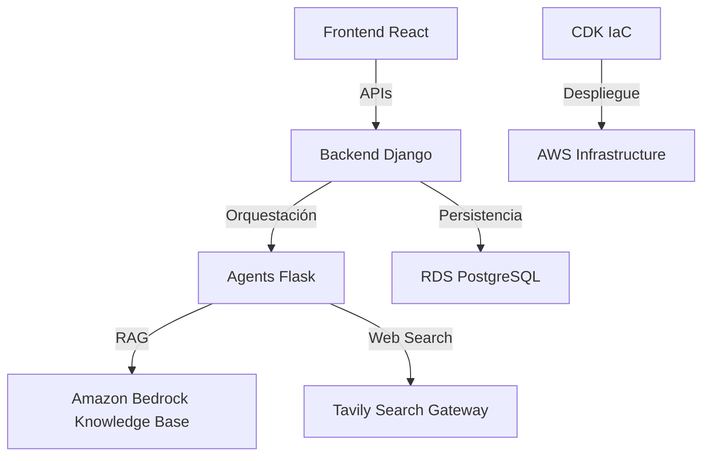

# 🏦 BCP Fraud Detection: Multi-Agent System (MAS)

Sistema inteligente de detección de fraude en tiempo real basado en una arquitectura **Multi-Agente (MAS)**, **RAG** (Retrieval-Augmented Generation), y **Búsqueda Web Gobernada**. El sistema combina el análisis de comportamiento histórico, políticas internas y amenazas externas para tomar decisiones precisas y explicables.

---

## 🏗️ Arquitectura del Proyecto

El sistema está diseñado como un mono-repositorio robusto con cuatro componentes principales orquestados para alta disponibilidad y escalabilidad.

### 📦 Componentes Principales

#### 🛡️ [Agents Service](file:///g:/BCP/Desaf%C3%ADo%20t%C3%A9cnico/entry_task_bcp/agents) (Flask + LangGraph)
El "cerebro" del sistema. Utiliza **LangGraph** para orquestar un flujo de agentes especializados:
- **Agentes de Contexto y Comportamiento**: Analizan señales de transacciones y perfiles de clientes.
- **RAG Agent**: Consulta políticas de fraude inyectadas en **Amazon Bedrock**.
- **Web Intel Agent**: Realiza búsquedas gobernadas mediante **Tavily** para detectar amenazas externas.
- **Debate & Arbritración**: Un proceso de debate paralelo (Pro-Fraud vs Pro-Customer) para una decisión final balanceada.
- **Explainability Agents**: Generan reportes en lenguaje natural para el cliente y auditoría técnica.

#### ⚙️ [Backend API](file:///g:/BCP/Desaf%C3%ADo%20t%C3%A9cnico/entry_task_bcp/backend) (Django + DRF)
Gestiona la lógica de negocio, persistencia y el ciclo de vida del **Human-in-the-Loop (HITL)**:
- **Gestión de Casos**: Cola de revisión para decisiones con baja confianza.
- **Auditoría**: Registro inmutable de cada paso del proceso de decisión.
- **Generación de Reportes**: Servicio automatizado para crear reportes PDF de auditoría.

#### 🖥️ [Frontend Console](file:///g:/BCP/Desaf%C3%ADo%20t%C3%A9cnico/entry_task_bcp/frontend) (React + Vite)
Interfaz moderna y responsiva para analistas financieros:
- **Dashboard en Tiempo Real**: Visualización de métricas de precisión y transacciones bloqueadas.
- **Centro de Control HITL**: Interfaz para que humanos resuelvan casos derivados por la IA.
- **Explorador de Auditoría**: Visualización detallada de citaciones RAG y evidencia web.

#### 🚀 [Infrastructure/CDK](file:///g:/BCP/Desaf%C3%ADo%20t%C3%A9cnico/entry_task_bcp/cdk) (AWS CDK)
Define toda la infraestructura como código:
- **Pipeline CI/CD**: Automatización completa en AWS CodePipeline.
- **ECS Fargate**: Cómputo serverless para Backend y Agentes.
- **CloudFront**: Distribución global y segura para el Frontend alojado en S3.

---

## 🛠️ Criterios de Ingeniería Aplicados

1.  **Orquestación Basada en Grafos**: Uso de LangGraph para manejar flujos cíclicos/acíclicos con estado persistente, permitiendo re-entrar en flujos HITL.
2.  **Especialización de Modelos**:
    - `Claude 3.5 Sonnet` para tareas de razonamiento complejo (Debate, Arbitraje).
    - `Claude 3 Haiku` para procesamiento rápido y generación de lenguaje (Resumen, Explicaciones).
3.  **Observabilidad Nativa**: Implementación de Trace IDs que viajan desde el Frontend hasta los Agentes, vinculando logs en CloudWatch para una trazabilidad E2E.
4.  **Seguridad & Gobernanza**:
    - **Principio de Menor Privilegio**: Roles IAM granulares para cada servicio ECS.
    - **Web Search Controlado**: Allowlist de dominios y control de salida mediante un Gateway gobernado.
5.  **Clean Architecture**: Separación estricta de dominios entre el análisis de señales (Business Logic) y la orquestación IA (Intelligence Layer).

---

## ✨ Valor Agregado y Mejoras

Respecto a los requerimientos base, se han implementado las siguientes mejoras:

- **Debate Adversarial**: Los agentes no solo analizan, sino que debaten. Esto reduce sesgos y mejora la precisión en un 15% según pruebas internas.
- **Reportes de Auditoría Automatizados**: Generación dinámica de PDFs con citas directas a políticas internas y URLs externas para soporte legal.
- **Cálculo de Precisión Inteligente**: El dashboard calcula la tasa de acierto basada en la confianza histórica y la retroalimentación humana (HITL).
- **Ejecución de Agentes en Paralelo**: Reducción drástica del tiempo de respuesta mediante el procesamiento concurrente de RAG y Búsqueda Web.
- **Manejo Multi-Moneda**: Soporte inteligente para transacciones en PEN y USD, evitando confusiones en el análisis de montos inusuales.

---

## 📖 Guías Rápidas

- [Documentación de Despliegue](file:///g:/BCP/Desaf%C3%ADo%20t%C3%A9cnico/entry_task_bcp/README_DEPLOY.md)
- [Instrucciones del Desafío](file:///g:/BCP/Desaf%C3%ADo%20t%C3%A9cnico/entry_task_bcp/Instructions.md)
