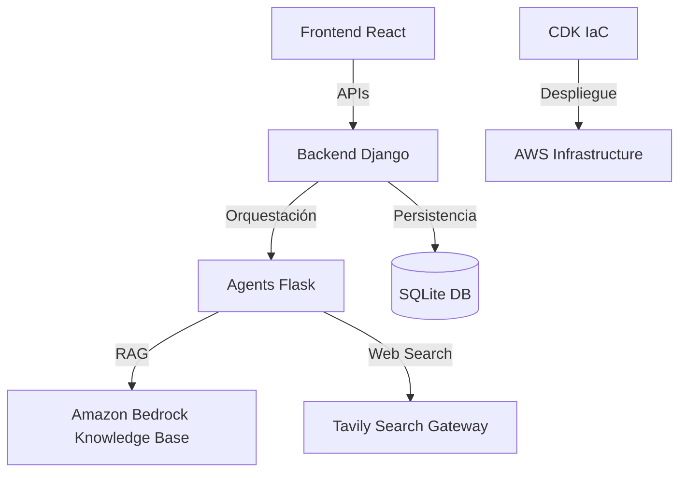

# 🏦 BCP Fraud Detection: Multi-Agent System (MAS)

Sistema inteligente de detección de fraude en tiempo real basado en una arquitectura **Multi-Agente (MAS)**, **RAG** (Retrieval-Augmented Generation), y **Búsqueda Web Gobernada**. El sistema combina el análisis de comportamiento histórico, políticas internas y amenazas externas para tomar decisiones precisas y explicables.

---

## 🏗️ Arquitectura y Estrategia Tecnológica

El sistema se divide en tres capas principales desacopladas para garantizar escalabilidad, seguridad y agilidad en el desarrollo.

### 🧠 ¿Por qué Django + Flask?
- **Django (Backend API)**: Se eligió como el núcleo de la aplicación por su robusto ORM (Object-Relational Mapper), sistema de autenticación integrado y capacidad para gestionar flujos de trabajo complejos como el **Human-in-the-Loop (HITL)**. Su estructura permite un manejo profesional de la base de datos y la lógica de auditoría.
- **Flask (Agents Service)**: Actúa como un microservicio ligero y de baja latencia especializado en la orquestación de IA. Al usar Flask para los agentes, aislamos la ejecución de **LangGraph** y las llamadas a LLMs, evitando que procesos largos de inferencia bloqueen la API transaccional de Django.

---

## 🔬 RAG vs. Comparaciones Lógicas: El "Por Qué"

Una de las decisiones arquitectónicas clave es el uso de **RAG (Retrieval-Augmented Generation)** para procesar las políticas de fraude, en lugar de depender únicamente de motores de reglas (`if/else`) tradicionales.

### Ventajas del enfoque RAG:
1.  **Flexibilidad Lingüística**: Las políticas de cumplimiento y riesgos suelen escribirse en lenguaje natural (ej: *"Bloquear transacciones sospechosas en perfiles de alto riesgo durante la madrugada"*). RAG permite que el sistema entienda estas reglas sin necesidad de traducirlas manualmente a código rígido.
2.  **Mantenimiento Ágil**: Actualizar una política es tan sencillo como subir un nuevo documento `.json` o `.pdf` a S3. No requiere cambios en el código fuente, despliegues de backend, ni migraciones de base de datos.
3.  **Búsqueda Semántica vs. Exacta**: A diferencia de una comparación lógica que falla si un valor no es exacto, RAG utiliza **embeddings** para encontrar políticas relacionadas por concepto. Si una transacción presenta un patrón "atípico pero no idéntico" a una regla, el sistema puede recuperar el contexto relevante.
4.  **Citas y Transparencia**: RAG permite que el agente genere una respuesta con **citaciones directas** al texto original de la política. Esto es fundamental para que el auditor humano entienda *exactamente qué línea del reglamento* motivó la decisión de la IA.

---

## 🛡️ Detalles del Sistema de Agentes

El servicio de agentes utiliza **LangGraph** para definir un grafo de estado donde cada nodo es un agente experto.

### 📝 Prompts y Lógica de Decisión

Los agentes utilizan prompts especializados según su rol:

| Agente | Lógica / Prompt Clave |
| :--- | :--- |
| **Evidence Aggregator** | "Resume los hallazgos clave de manera objetiva, resaltando conflictos entre la conducta del cliente y las políticas o alertas externas." |
| **Debate (Pro-Fraud)** | "Actúa como un Investigador Forense. Argumenta de forma agresiva por qué esta transacción DEBERÍA ser bloqueada." |
| **Debate (Pro-Customer)** | "Actúa como un Defensor de la Experiencia del Cliente. Argumenta por qué esta transacción podría ser LEGÍTIMA." |
| **Decision Arbiter** | "Balancea el riesgo financiero con la experiencia del cliente. Si la confianza es < 0.6, escala a humano (HITL)." |
| **Explainability** | Genera reportes diferenciados: uno empático para el cliente y uno técnico cargado de evidencias para el auditor. |

### ⚡ Patrones de Diseño
- **State Graph (LangGraph)**: Orquestación cíclica y paralela.
- **Parallel Execution**: Los agentes de RAG y Búsqueda Web se ejecutan en paralelo para reducir el tiempo de respuesta (latency).
- **Specialized LLM Roles**: Uso de `Claude 3.5 Sonnet` para razonamiento crítico y `Claude 3 Haiku` para tareas de extracción y resumen.

---

## 📊 Persistencia y Audit Trail

### 💾 Almacenamiento de Datos
1.  **Datos Estructurados (SQLite)**: En esta versión, se utiliza SQLite para persistir `Transactions`, `CustomerProfiles`, `DecisionRecords` y `AuditEvents`. El ORM de Django asegura una transición fluida a bases de datos de grado de producción (como PostgreSQL) en el futuro.
2.  **Datos No Estructurados (Amazon Bedrock KB)**: Las políticas de fraude se ingestan en un Knowledge Base de Bedrock, permitiendo búsquedas semánticas (RAG) sin necesidad de pre-procesar reglas rígidas.

### 📜 Audit Trail (Trazabilidad)
Cada decisión genera un rastro de auditoría inmutable:
- **`DecisionRecord`**: Almacena el resultado final, el nivel de confianza (0-1), las señales detectadas y las citaciones exactas de políticas.
- **`AuditEvent`**: Un log detallado que registra la "Ruta de Agentes" (ej: `Context -> Behavior -> RAG -> ...`) y los metadatos de cada interacción.
- **Reportes PDF**: Se utiliza el **Patrón Factory** en `report_service.py` para generar reportes descargables que consolidan toda la evidencia técnica.

---

## 🔑 Gestión de Secretos y Seguridad

El proyecto implementa prácticas recomendadas de seguridad en AWS:
- **AWS Secrets Manager**: Almacena llaves sensibles como `TAVILY_API_KEY`, `LANGCHAIN_API_KEY` y `DJANGO_SECRET_KEY`. Esto evita que las llaves estén expuestas en el código o en variables de entorno locales.
- **AWS Systems Manager (Parameter Store)**: Gestiona configuraciones de entorno (ej: `BEDROCK_KB_ID`, `DJANGO_DEBUG`) de forma centralizada.
- **Gobierno de Búsqueda**: La búsqueda web a través de **Tavily** está limitada a una `allowlist` de dominios confiables (bcp.com.pe, gestion.pe, etc.), mitigando el riesgo de alucinaciones basadas en fuentes no oficiales.

---

## 🎨 Frontend y UI
- **Arquitectura**: Basada en componentes funcionales de **React** y **Vite**.
- **User Experience**: Dashboard dinámico que muestra métricas de salud del sistema, transacciones en tiempo real y una cola de gestión de casos (HITL) para que analistas humanos tomen decisiones finales en casos ambiguos.

---

## 🚀 Guías Complementarias
- [Guía de Despliegue (AWS)](README_DEPLOY.md)
- [Instrucciones Originales](Instructions.md)
